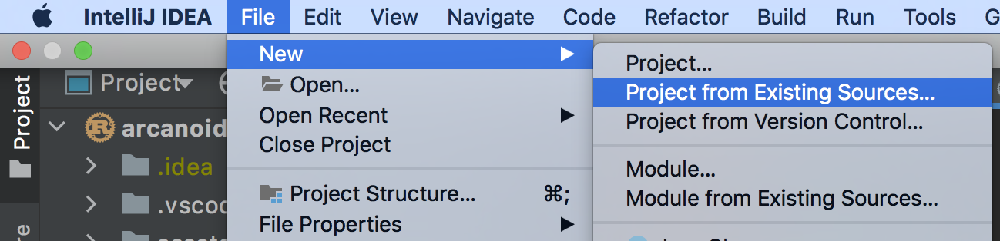

# Rust bevy-ecs tutorial

## Цикл уроков по созданию 2d игры "Арканоид" с использованием паттерна ECS на языке Rust
Что такое ECS? ECS (Entity, Component, System) это паттерн проектирования, в основном использующийся при создании игр, который вводит новую парадигму, противоположную общепринятому ООП.
Использование этого паттерна значительно улучшает читаемость кода, а иногда и производительность.
Сравнив, как выглядит код игры написанной с применением ООП против ECS, я сделал для себя вывод, что проще разобраться именно с ECS кодом.

Что означают слова в аббревиатуре?
### Entity
Сущностью может быть все что угодно, например игрок (Player). Более того, сущностью это скорее указатель на набор **компонентов**. Отличие от ООП подхода в том, что Player не хранит в себе свойства (HP, Speed, Velocity etc), за счет чего достигается низкая связность кода и решается классическая diamond OOP [problem](shorturl.at/bKZ69).

### Component
Компоненты представляют уникальные свойства игровых объектов (сущностей), например: ускорение, здоровье, местоположение, количество патронов итд. Обратите внимание, что компоненты не связаны друг с другом и в них нет логики. 

### System
Вся логика находится в ECS системах, которые обрабатывают события, обновляют компоненты, просчитывают физику итд. За счет того, что сущности не хранят в себе отдельные свойства (компоненты), системы также можно разделить по функционалу и _распараллелить_ выполнение. Например, система гравитации может производить вычисления параллельно с системой расчета здоровья. Опять низкая связанность.

### Минусы
Я описал плюсы и то, что мне нравится, но и минусы тоже есть. 

1. Порядок объявления систем важен (мы увидим это позже). Более того, если говорить именно про bevy, порядок может быть и вовсе не очевиден, что ведет к сложным ошибкам.
2. Просто взять и переписать игру на ECS неполучится, это другая парадигма, нужно будет учиться думать в других терминах, потому что многие ООП паттерны не подойдут.

## Bevy
У ECS есть много реализаций, но я буду использовать bevy-ecs, тк взял движок bevy за основу. В unity есть своя реализация ECS, некоторые игры делают ECS под себя, например [veloren](https://github.com/veloren/veloren).

Давайте начнем.

## Урок 1. Создание окна

Bevy позволяет сделать окно буквально в три строки. 
Но сначала, нужно сделать проект:
```shell
cargo new bevy_breakout_game_tutorial --bin
cd bevy_breakout_game_tutorial
```

Импортируйте проект в Idea:


Затем, добавьте зависимость `bevy`:
```toml
[dependencies]
bevy = { version = "0.7", features = ["dynamic"] }
```
Я указал `features = ["dynamic"]`, чтобы проект быстрее компилировался, не забудьте убрать это свойство в конце.

И теперь можно сделать само окно. Для этого добавьте в файл `main.rs` следующий код:
```rust
use bevy::{
    prelude::*,
};

fn main() {
    App::new()
        .add_plugins(DefaultPlugins)
        .run();
}
```
После запуска у вас должно появится пустое окно с заголовком `app`.
Некоторые плагины в bevy конфигурируются через ресурсы, в частности `WindowPlugin`. Чтобы изменить заголовок окна, добавьте следующий код:
```rust
fn main() {
    App::new()
        .insert_resource(WindowDescriptor {
            title: "Rust & Bevy Breakout game!".to_string(),
            ..default()
        })
        .add_plugins(DefaultPlugins)
        .run();
}
```
И последний штрих, добавим нашу первую ECS систему! 
Прежде чем мы это сделаем, важно понимать, что несмотря на простоту кода, `DefaultPlugins` содержит в себе много плагинов. 
Один из них добавляет бесконечный цикл, в котором работает приложение `App`. Благодаря этому циклу, мы можем прослушивать события, например нажатия клавиш. В данном примере я добавлю систему, которая будет прослушивать нажатие кнопки `ESC` и закрывать программу:
```rust
fn main() {
    App::new()
        .insert_resource(WindowDescriptor {
            title: "Rust & Bevy Breakout game!".to_string(),
            ..default()
        })
        .add_plugins(DefaultPlugins)
        .add_system(bevy::input::system::exit_on_esc_system) // обработчик кнопки ESC
        .run();
}
```

В следующем уроке добавим камеру и главную сцену.
