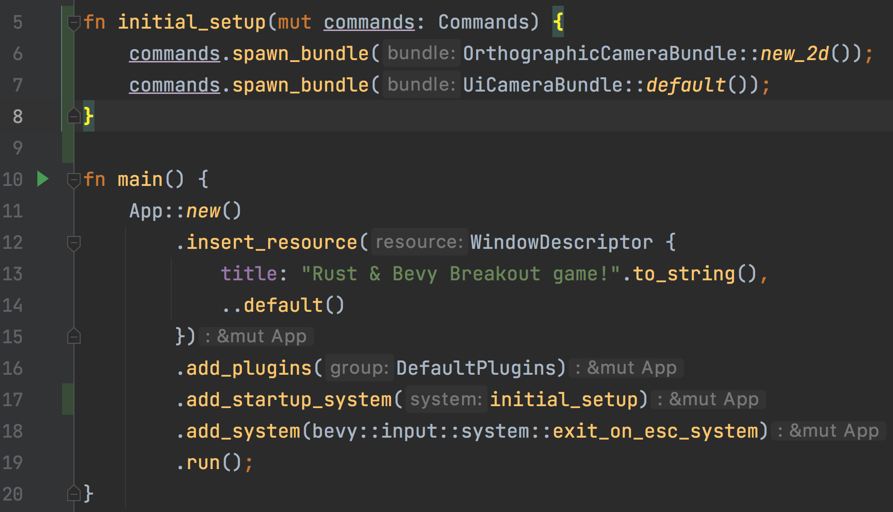
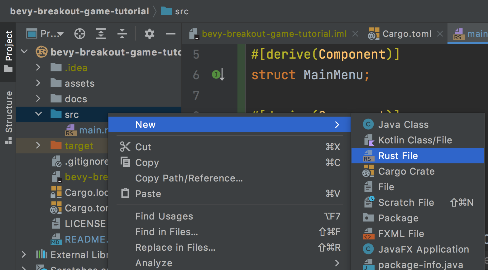
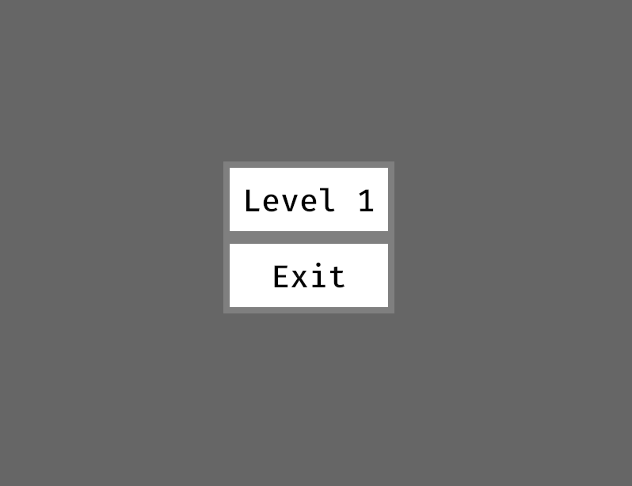
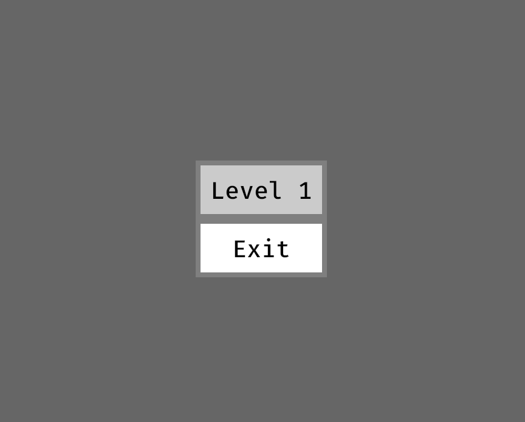

# Урок 2. Главное меню

Итак, у нас уже есть окно, можно начинать создавать игру.
Первое, что мы видим в играх — это меню, где находятся кнопки с настройками, входом в игру, загрузкой итд.
В нашей игре будут кнопки с уровнями и кнопка выхода. Начав изучать, как работает переход между разными сценами в ECS я удивился, потому что это довольно сложно.

Игра представляет собой бесконечный цикл с отрисовкой, просчетом физики, столкновений, отправкой событий итд. Но в игровом меню не нужно просчитывать физику, скорость и другие вещи.
Есть просто статичное меню. Как сделать так, чтобы внутри игрового цикла было разделение на режим игры и режим отрисовки меню? Первое, что приходит в голову — использовать условные ветвления _if_ _else_.
Но такой подход плохо масштабируется, если в вашей игре десятки сцен, например, меню с большой вложенностью (настройки графики, настройки управления, настройки игры, настройки сети итд, все на разных экранах), код быстро придет в негодность из-за обилия проверок.
Нужен другой способ.

И он есть! Bevy предоставляет инструментарий условного запуска систем, с помощью которого вынести логику проверки текущего состояния на уровень выше (bevy `App`).
Но тут есть еще одна загвоздка — встроенный инструментарий bevy не позволяет комбинировать системы, например, использовать несколько [run_criteria](https://bevy-cheatbook.github.io/programming/run-criteria.html).
Позже нам потребуется эта возможность, для того, чтобы описать две независимые системы — одна для расчета физики, которая будет запускаться 60 раз в секунду, а вторая делает все остальное на максимальной скорости.
Таким образом я ограничиваю CPU intensive вычисления, чтобы снизить нагрузку.

Поэтому, мы будем использовать альтернативный инструмент для управления состоянием — `iyes_loopless`, который я уже подключил в `Cargo.toml` файл.

Итак, приступим!

Перед тем, как отображать что-либо на сцене, нужно создать камеру. У нас их будет две, одна для отображения интерфейса меню, вторая для игры, которую используем позже:


Затем, я сделал отдельный файл `menu.rs`, в котором буду описывать меню. Внутри он будет содержать плагин, который будет подключаться к корневому `App` в файле `main.rs`:


```rust
use bevy::{
    prelude::*,
};

#[derive(Component)]
struct MainMenu;

#[derive(Component)]
struct ExitButton;

#[derive(Component)]
struct Level1Button;

fn menu_setup(mut commands: Commands, asset_server: Res<AssetServer>) {
    let button_style = Style {
        justify_content: JustifyContent::Center,
        align_items: AlignItems::Center,
        padding: Rect::all(Val::Px(8.0)),
        margin: Rect::all(Val::Px(4.0)),
        flex_grow: 1.0,
        ..Default::default()
    };
    let button_textstyle = TextStyle {
        font: asset_server.load("FiraMono-Medium.ttf"),
        font_size: 24.0,
        color: Color::BLACK,
    };

    let menu = commands
        .spawn_bundle(NodeBundle {
            color: UiColor(Color::rgb(0.5, 0.5, 0.5)),
            style: Style {
                size: Size::new(Val::Auto, Val::Auto),
                margin: Rect::all(Val::Auto),
                align_self: AlignSelf::Center,
                flex_direction: FlexDirection::ColumnReverse,
                justify_content: JustifyContent::Center,
                ..Default::default()
            },
            ..Default::default()
        })
        .insert(MainMenu)
        .id();

    let level1_button = commands
        .spawn_bundle(ButtonBundle {
            style: button_style.clone(),
            ..Default::default()
        })
        .with_children(|btn| {
            btn.spawn_bundle(TextBundle {
                text: Text::with_section("Level 1", button_textstyle.clone(), Default::default()),
                ..Default::default()
            });
        })
        .insert(Level1Button)
        .id();

    let button_exit = commands
        .spawn_bundle(ButtonBundle {
            style: button_style.clone(),
            ..Default::default()
        })
        .with_children(|btn| {
            btn.spawn_bundle(TextBundle {
                text: Text::with_section("Exit", button_textstyle.clone(), Default::default()),
                ..Default::default()
            });
        })
        .insert(ExitButton)
        .id();

    commands
        .entity(menu)
        .push_children(&[level1_button, button_exit]);
}

#[derive(Default)]
pub struct MenuPlugin;

impl Plugin for MenuPlugin {
    fn build(&self, app: &mut App) {
        app.add_startup_system(menu_setup);
    }
}
```
Пока что у нас будет две кнопки: `Level 1` и `Exit`.

Теперь у нас есть `MenuPlugin`, который можно подключить к движку bevy. Добавьте строку `.add_plugin(menu::MenuPlugin)` сразу после `.add_startup_system(initial_setup)`:
```rust
fn main() {
    App::new()
        .insert_resource(WindowDescriptor {
            title: "Rust & Bevy Breakout game!".to_string(),
            ..default()
        })
        .add_plugins(DefaultPlugins)
        .add_startup_system(initial_setup)
        .add_plugin(menu::MenuPlugin)
        .add_system(bevy::input::system::exit_on_esc_system)
        .run();
}
```

Должно получиться такое окно:


## Взаимодействие с интерфейсом

Bevy предоставляет богатые возможности для создания интерфейсом. Одна из них — это `Interaction` ECS компонент. Он описывает состояние элемента: `Clicked`, `Hovered`, `None`.
Используя эти данные, можно сделать кнопки интерактивными, менять оттенок при наведении мышкой или нажатии. Для этого, нужно добавить новую систему в меню:
```rust
fn button_change_state(
    mut query: Query<(&Interaction, &mut UiColor), (Changed<Interaction>, With<Button>)>,
) {
    for (interaction, mut color) in query.iter_mut() {
        match interaction {
            Interaction::Clicked => {
                *color = UiColor(Color::rgb(0.75, 0.75, 0.75));
            }
            Interaction::Hovered => {
                *color = UiColor(Color::rgb(0.8, 0.8, 0.8));
            }
            Interaction::None => {
                *color = UiColor(Color::rgb(1.0, 1.0, 1.0));
            }
        }
    }
}

#[derive(Default)]
pub struct MenuPlugin;

impl Plugin for MenuPlugin {
    fn build(&self, app: &mut App) {
        app
            .add_startup_system(menu_setup)
            .add_system(button_change_state);
    }
}
```
Используя `Query`, система `button_change_state` получает только те кнопки, у которых изменился компонент `Interaction`, и меняет цвет в зависимости от состояния.



### Обработка нажатий

Пришло время задействовать `iyes_loopless`!

Первым делом нужно понять, когда произошло нажатие и обработать его. Для этого объявим систему, которая будет возвращать логическое значение, если произошло нажатие на определенную кнопку:
```rust
fn on_pressed<B: Component>(
    query: Query<&Interaction, (Changed<Interaction>, With<Button>, With<B>)>,
) -> bool {
    for interaction in query.iter() {
        if *interaction == Interaction::Clicked {
            return true;
        }
    }
    false
}
```

Далее объявим обработчики нажатий на кнопки:
```rust
fn on_level1_button_pressed() {
    println!("Level 1 button pressed");
}

fn on_exit_button_pressed(mut ev: EventWriter<bevy::app::AppExit>) {
    ev.send(bevy::app::AppExit);
}
```

У функции `on_pressed` есть обобщенный параметр, в который мы будем подставлять нашли кнопки:
```rust
impl Plugin for MenuPlugin {
    fn build(&self, app: &mut App) {
        app
            .add_startup_system(menu_setup)
            .add_system(button_change_state)
            .add_system(on_level1_button_pressed.run_if(on_pressed::<Level1Button>))
            .add_system(on_exit_button_pressed.run_if(on_pressed::<ExitButton>));
    }
}
```
Этот код говорит следующее: запусти систему `on_level1_button_pressed`, когда система `on_pressed` выполниться с результатом `true` для кнопки `Level1Button`.

Теперь, если вы запустите игру, можно проверить кнопки. Если все ок, вы увидите сообщение в терминале, при нажатии на кнопку `Level 1`. А также кнопка `Exit` будет закрывать приложение.

В следующем [уроке](../lesson3/index.md) добавим состояние и игровую сцену.


