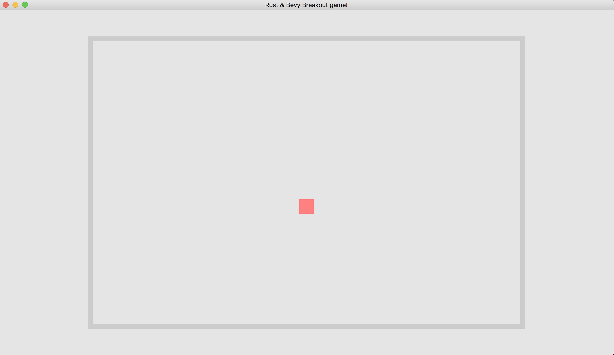
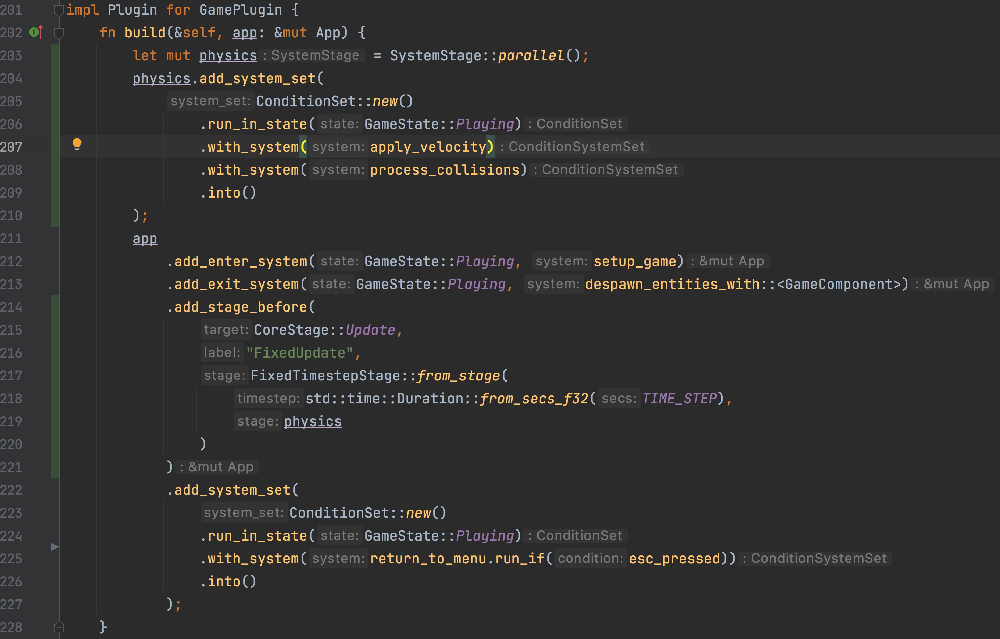

# Урок 4. Движение

Когда я читал мануалы по opengl, для меня было большим открытием, что на самом деле в играх ничего не движется.
Ни в 2d, ни в 3d. Иллюзия движения достигается за счет быстрой смены кадров (прямо как в кино).
Каждый кадр (_frame_) игра перерисовывает объекты, которые должны двигаться, немного смещая их, таким образом, чтобы например, при скорости 60 кадров в секунду получалось плавное движение.

В нашей игре главным движущимся объектом будет шар.
Чтобы он двигался, я буду каждый кадр менять позицию спрайта, таким образом, шар будет исчезать из старого положения и появляться в новом.
Тк промежуточное состояние, когда старый спрайт был удален, не отрисовывается, мы не видит исчезновения мяча. За счет этого достигается иллюзия движения без эффекта стробоскопа. 


Начнем с отрисовки статичного мяча.

Нам понадобятся новые импорты:
```rust
use bevy::{
    prelude::*,
    input::ElementState,
    input::keyboard::KeyboardInput,
    math::{const_vec2, const_vec3}
};
```

Свойства мяча вынесем в константы:
```rust
const BALL_STARTING_POSITION: Vec3 = const_vec3!([0.0, -50.0, 1.0]);
const BALL_SIZE: Vec3 = const_vec3!([30.0, 30.0, 0.0]);
const BALL_SPEED: f32 = 400.0;
const INITIAL_BALL_DIRECTION: Vec2 = const_vec2!([0.5, -0.5]);

const BACKGROUND_COLOR: Color = Color::rgb(0.9, 0.9, 0.9);
const WALL_COLOR: Color = Color::rgb(0.8, 0.8, 0.8);
const BALL_COLOR: Color = Color::rgb(1.0, 0.5, 0.5);
```

Добавим компонент для мяча и ускорения:
```rust
#[derive(Component)]
struct Ball;

#[derive(Component, Deref, DerefMut)]
struct Velocity(Vec2);
```

Теперь можно отрисовать мяч внутри системы `setup_game`:
```rust
// Ball
    commands
        .spawn()
        .insert(Ball)
        .insert_bundle(SpriteBundle {
            transform: Transform {
                scale: BALL_SIZE,
                translation: BALL_STARTING_POSITION,
                ..default()
            },
            sprite: Sprite {
                color: BALL_COLOR,
                ..default()
            },
            ..default()
        })
        .insert(Velocity(INITIAL_BALL_DIRECTION.normalize() * BALL_SPEED))
        .insert(GameComponent);
```
Должно получиться вот так:



### Движение
Чтобы мяч двигался, нужно добавить систему, которая будет обновлять позицию спрайта:
```rust
fn apply_velocity(mut query: Query<(&mut Transform, &Velocity)>) {
    for (mut transform, velocity) in query.iter_mut() {
        transform.translation.x += velocity.x * TIME_STEP;
        transform.translation.y += velocity.y * TIME_STEP;
    }
}
```
И добавить ее в игровой цикл:
```rust
ConditionSet::new()
    .run_in_state(GameState::Playing)
    .with_system(apply_velocity)
    .with_system(return_to_menu.run_if(esc_pressed))
    .into()
```
Теперь при запуске игры мяч сразу улетает за границу экрана.

### Обнаружение столкновений

А теперь то, ради чего задумывался этот туториал: сделаем систему, которая будет работать с ограниченной скоростью 60 кадров в секунду и при этом запускаться только в состоянии `GameState::Playing`.
Чтобы мяч оставался на поле, надо сделать так, чтобы он отскакивал от стен.
Добавим систему обработки столкновений:
```rust
fn process_collisions(
    mut ball_query: Query<(&mut Velocity, &Transform), With<Ball>>,
    collider_query: Query<&Transform, With<Collider>>,
) {
    let (mut ball_velocity, ball_transform) = ball_query.single_mut();
    let ball_size = ball_transform.scale.truncate();

    for transform in collider_query.iter() {
        let collision = collide(
            ball_transform.translation,
            ball_size,
            transform.translation,
            transform.scale.truncate(),
        );
        if let Some(collision) = collision {

            let mut reflect_x = false;
            let mut reflect_y = false;

            // only reflect if the ball's velocity is going in the opposite direction of the
            // collision
            match collision {
                Collision::Left => reflect_x = ball_velocity.x > 0.0,
                Collision::Right => reflect_x = ball_velocity.x < 0.0,
                Collision::Top => reflect_y = ball_velocity.y < 0.0,
                Collision::Bottom => reflect_y = ball_velocity.y > 0.0,
                Collision::Inside => { /* do nothing */ }
            }
            if reflect_x {
                ball_velocity.x = -ball_velocity.x;
            }
            if reflect_y {
                ball_velocity.y = -ball_velocity.y;
            }
        }
    }
}
```
Теперь сложная часть, нам нужно добавить систему физики, которая будет запускаться в отдельном от главного цикла этапе:


Если вы сделали все правильно, шар начнет двигаться.

В следующем уроке рассмотрим, как сделать управление, создание и разрушение блоков.